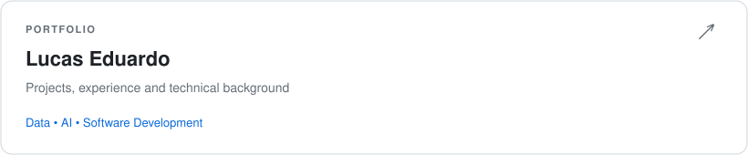
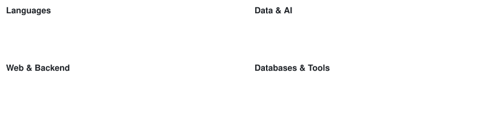
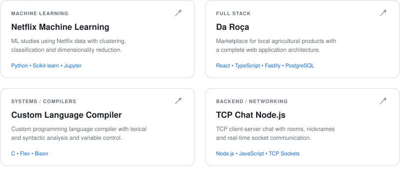

# Hi, I'm Lucas Eduardo 👋

Computer Engineering student at UNIFEI, focused on Data, Artificial Intelligence and Software Development.

I have experience with full-stack development, project management and practical applications involving Python, SQL, Machine Learning, React and TypeScript.

Currently, I am strengthening my skills in Data Science, AI and software engineering while building projects that connect technical development with real-world problems.

---

# Olá, eu sou Lucas Eduardo 👋

Estudante de Engenharia de Computação na UNIFEI, com foco em Dados, Inteligência Artificial e Desenvolvimento de Software.

Tenho experiência com desenvolvimento full-stack, gerenciamento de projetos e aplicações práticas envolvendo Python, SQL, Machine Learning, React e TypeScript.

Atualmente, estou aprofundando meus conhecimentos em Ciência de Dados, IA e engenharia de software, desenvolvendo projetos que conectam tecnologia à resolução de problemas reais.

## 🛠️ Tech Stack

## 🚀 Featured Projects

  <a href="https://github.com/lucasedglima/netflix-machine-learning">Netflix Machine Learning</a> ·
  <a href="https://github.com/lucasedglima/da-roca">Da Roça</a> ·
  <a href="https://github.com/lucasedglima/custom-language-compiler">Custom Language Compiler</a> ·
  <a href="https://github.com/lucasedglima/tcp-chat-nodejs">TCP Chat Node.js</a>

